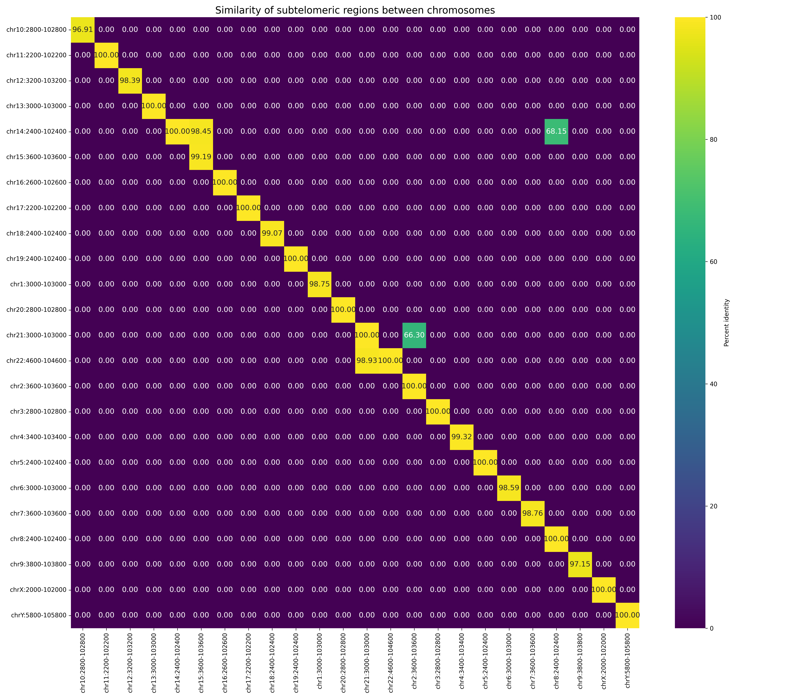

# The similarity of human subtelomeric sequences at various scales
This repository contains a workflow for computing and visualizing sequence identity between subtelomeric regions of human chromosomes.  
The pipeline calculates pairwise identity between chromosome arms and generates a heatmap summarizing similarities.

## Overview
Subtelomeres are regions immediately adjacent to the telomeric repeats, forming the transition zone between the highly repetitive telomeric region (TTAGGG) and the gene-rich euchromatin of the chromosome. Subtelomeres consist of heterogeneous sequence repetitions, making them notoriously difficult to map and sequence. In humans, their size is highly variable (up to 500 kb in each autosomal arm), and they are highly polymorphic. Due to the presence of blocks of highly similar, yet non-identical, repeated sequences (known as Segmental Duplications), subtelomeres exhibit the highest instability in the genome. These highly similar sequences across non-homologous chromosomes are the main hotspots for inaccurate recombination during meiosis, known as Non-Allelic Homologous Recombination (NAHR). This process can lead to large-scale rearrangements like deletions, duplications, or segmental duplication amplification, which are implicated in many genetic syndromes and intellectual disabilities. Studying subtelomeres is crucial for understanding how gene replication and transcription are regulated in the immediate vicinity of the telomeres. Sequence comparison aids in elucidating the mechanisms by which chromosomes maintain their length and integrity despite the constant risk of incorrect DNA repair.

## WDL Workflow: ```workflow/subtelomeric_project.wdl```
1. Workflow structure
The pipeline processes P-arm (start/short) and Q-arm (end/long) subtelomeres separately, but with the same sequence of steps, creating with following tasks:

| Step                     | WDL task                          | Description                                                                                                                                                   |
|---------------------------|-----------------------------------|---------------------------------------------------------------------------------------------------------------------------------------------------------------|
| Split BED & Apply Padding               | ```split_bed.wdl``` ```pad_bed.wdl```  | Splits the input BED file containing the telomeric regions into P and Q arm regions and performs padding. The padding extends from the telomeric end toward the centromere to capture the subtelomeric region. |
| Extraction                | ```bed_to_fasta.wdl```            | Extracts the genomic sequences from the reference FASTA genome for the padded subtelomeric regions.                                                          |
| Alignment                 | ```mashmap_align.wdl```           | Performs pairwise all-vs-all alignment of the subtelomeric sequences to identify shared homologies.                                                        |
| Calculation of identity   | ```pairwise_identity.wdl```       | Processes the Mashmap output (.paf file) to calculate a pairwise sequence identity matrix for the subtelomeric regions.                                     |
| Visualization             | ```plot_heatmap.wdl```            | Generates a heatmap visualizing the pairwise identity matrix and sequence similarity between subtelomeric regions.                                        |

3. Input parameters

  | Parameter  | Type | Description |
|------------|------|-------------|
| bed_file   | File | Input BED file defining the subtelomeric boundaries. |
| pad        | Int  | The number of bases used for padding (e.g., 100000 for 100 kb). |
| fasta_ref  | File | The reference genome in FASTA format. |
| script     | File | The Python script used for generating the heatmap visualization. |

4. Outputs
   
The workflow produces the final identity matrices and visualizations for both chromosomal arms:
  * p_arm_identity_matrix: Identity matrix for P-arms.
  * q_arm_identity_matrix: Identity matrix for Q-arms.
  * p_arm_heatmap: Final heatmap image for P-arm subtelomeres.
  * q_arm_heatmap: Final heatmap image for Q-arm subtelomeres




5. Running the workflow
The pipeline can be executed using any WDL-compatible workflow engine, such as Cromwell:

```
java -jar cromwell.jar run [workflow_script.wdl] -i [inputs.json]
```

### Testing with example data
To quickly test the workflow, you can use the provided example dataset in the `test_data/` folder. This allows you to verify that the pipeline runs correctly without using the full genome reference.

Example command:

```
java -jar cromwell.jar run subtelomeric_project.wdl -i test_data/inputs.json
```

